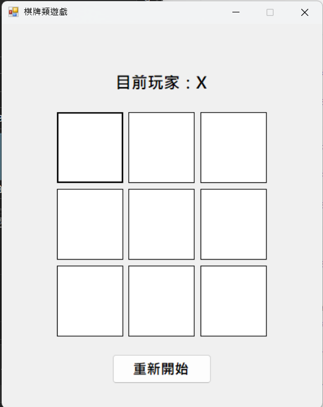

# 棋牌類遊戲 - 井字棋

## 專案簡介

本專案是一個使用 C# Windows Forms 製作的棋牌類小遊戲，遊戲內容為井字棋。玩家可以輪流在九宮格中放置 X 與 O，先連成一直線的玩家獲勝。

## 遊戲功能

- 3 x 3 井字棋棋盤
- 玩家 X 與玩家 O 輪流操作
- 自動判斷勝負
- 平手判斷
- 獲勝時會標示連線格子
- 點擊與獲勝時有音效
- 可重新開始遊戲

## 執行方式

1. 使用 Visual Studio 2022 開啟專案
2. 開啟 `.sln` 檔
3. 按下 Start 執行程式
4. 兩位玩家輪流點擊棋盤格子進行遊戲

## 遊戲畫面截圖

請將遊戲執行畫面截圖後，命名為 screenshot.png，放在專案資料夾中。

## 開發工具

- Visual Studio 2022
- C#
- Windows Forms App (.NET Framework)

## 學習心得

透過本次作業，我練習了 Windows Forms 的 GUI 設計、Button 事件處理、陣列管理控制項，以及遊戲勝負邏輯判斷。過程中也學到如何使用 GitHub 管理專案，並透過 README.md 說明專案內容。
